# React Native Threads Clone with Clerk, Convex & Sentry

This is a React Native Threads clone using [Clerk](https://go.clerk.com/WKHSBp0) for user authentication and [Convex](https://convex.dev) for all backend logic.

For improved debuggability, we've added [Sentry](https://sentry.io) to the project.

Additional features:

- [Expo Router](https://docs.expo.dev/routing/introduction/) file-based navigation
- [Convex Database](https://docs.convex.dev/database) for data storage
- [Convex File Storage](https://docs.convex.dev/file-storage) for file storage
- [Convex Actions](https://supabase.com/edge-functions) for push notifications
- [Sentry](https://docs.sentry.io/platforms/react-native) for error tracking
- [Haptics](https://docs.expo.dev/versions/latest/sdk/haptics/) for haptic feedback
- [Reanimated](https://docs.swmansion.com/react-native-reanimated/) for powerful animations
- [Image Zoom](https://github.com/likashefqet/react-native-image-zoom) for image zoom component

## Setup

### Environment Setup

Make sure you have the [Expo CLI](https://docs.expo.dev/get-started/set-up-your-environment/) installed.

Because we are using pre-built and a custom development client, you should download [Android Studio](https://developer.android.com/studio) and [Xcode](https://developer.apple.com/xcode/) to your Mac. For more information on setting up your development environment, refer to the [Expo documentation](https://docs.expo.dev/workflow/android-studio-emulator/) for Android Studio and the [React Native documentation](https://reactnative.dev/docs/environment-setup?guide=native) for Xcode.

### App Setup

To build the app, perform the following steps:

1. Clone the repository
2. Run `npm install`
3. Run `npx expo prebuild`
4. Run `npx expo run:ios` or `npx expo run:android`

Add the access key to the Convex environment variables:

```sh
npx convex env set EXPO_ACCESS_TOKEN your-api-key

```

## Clerk Setup

### Authentication Setup

Create a [Clerk](https://clerk.com/) account and project, then update the `convex/auth.config.js` file with your `domain` and `applicationID`.

```js
export default {
  providers: [
    {
      domain: "https://your-clerk-domain.clerk.accounts.dev",
      applicationID: "your-clerk-application-id",
    },
  ],
};
```

You also need to connect Convex and Clerk with a JWT template. For this, cehck out the video and [Convex docs](https://docs.convex.dev/auth/clerk).

### Webhook Setup

You need to set up a webhook in Clerk to handle the user creation and update events.

1. Go to [Clerk](https://clerk.com) and select your project
2. Go to **API** and select **Webhooks**
3. Add the following webhook, which should point to your Convex instance and include the `user.created` and `user.deleted` events:

## Sentry Setup

1. Create a [Sentry](https://sentry.io) account and project
2. Go to **Project Settings** and select **Client Keys**
3. Copy the DSN and add it to the `.env` file

## App Screenshots

<div style="display: flex; flex-direction: 'row';">
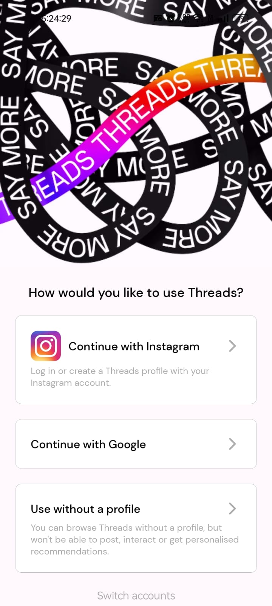
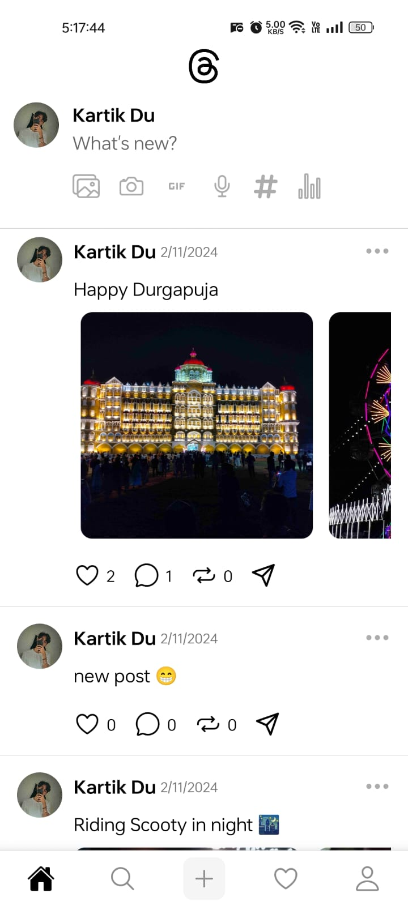
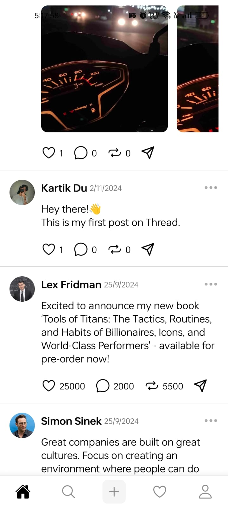

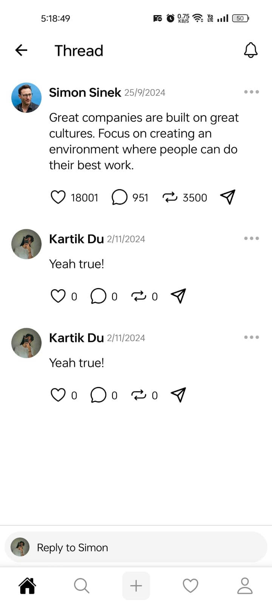
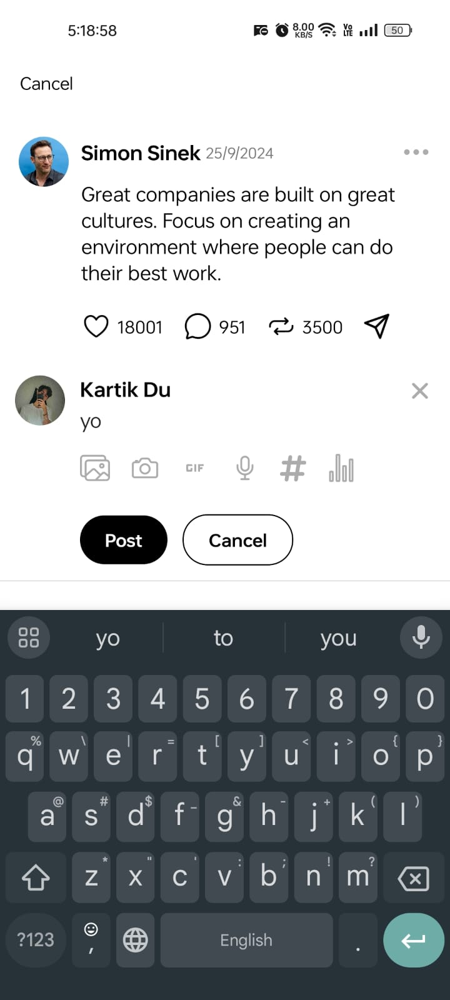

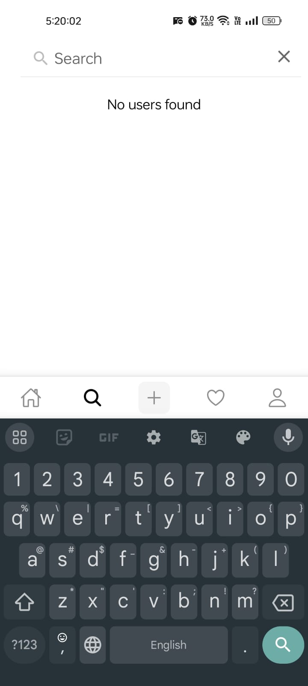
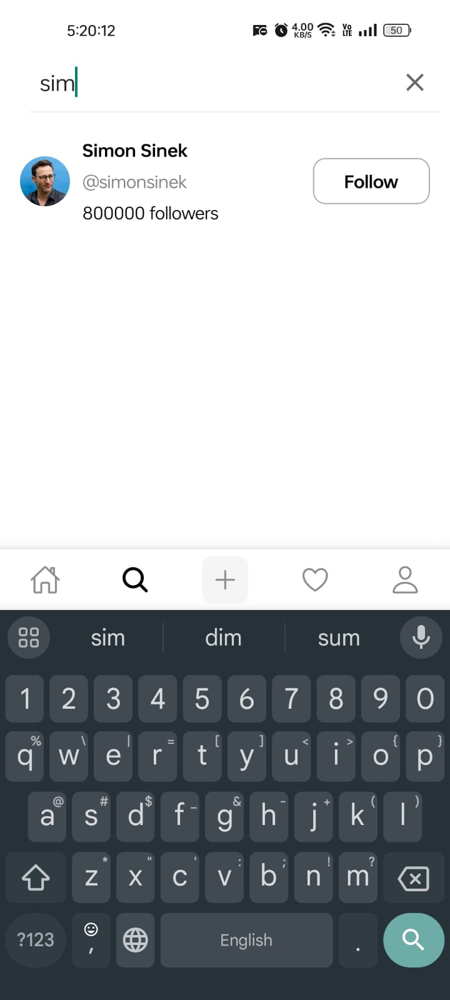
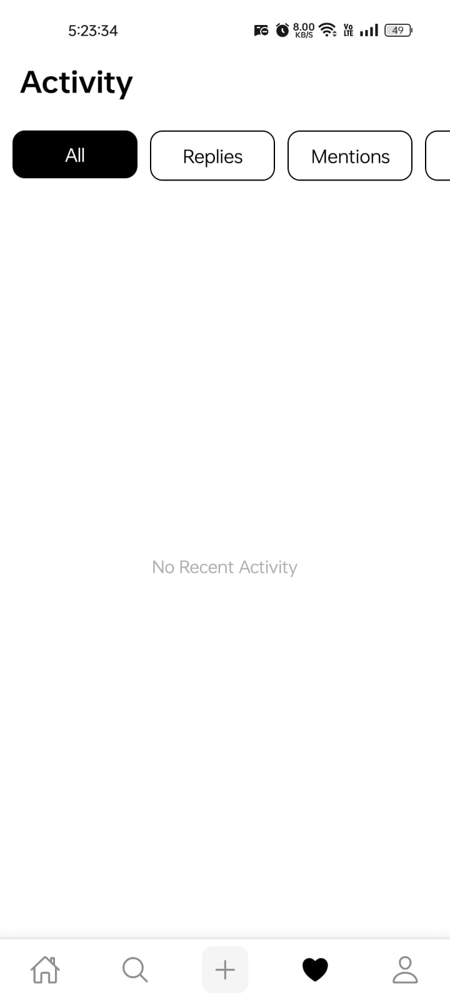
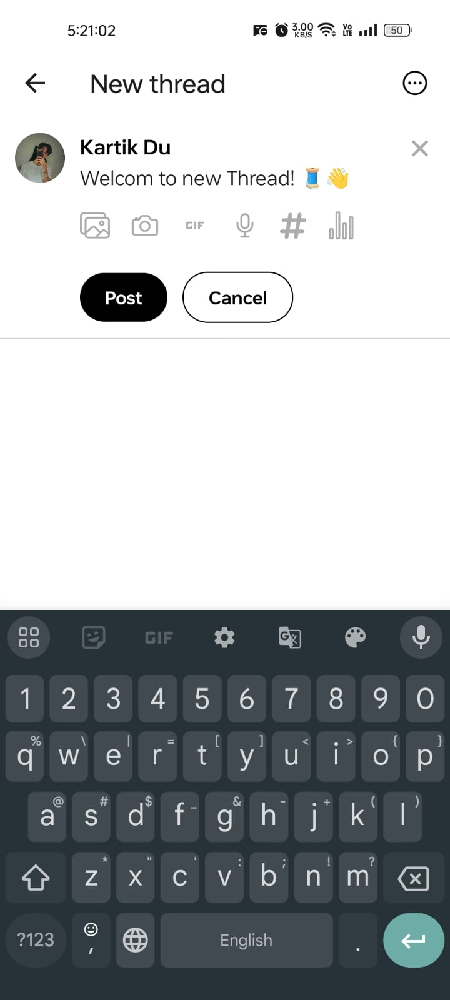
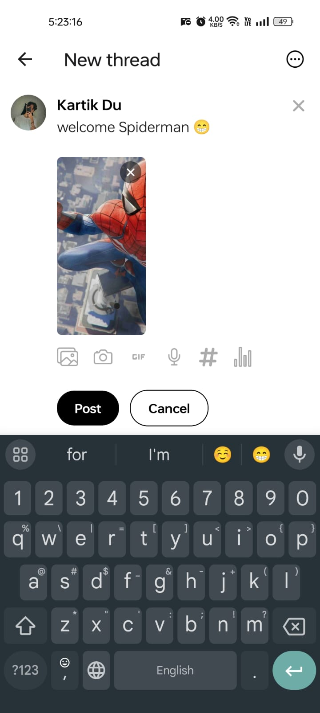


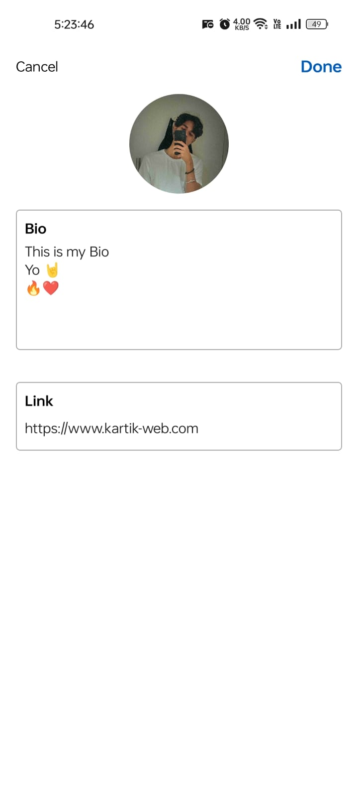
</div>
